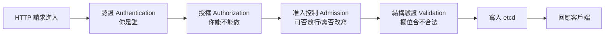

# API Server：叢集的唯一入口與請求生命週期

kube-apiserver 是整個叢集的唯一入口，本質上就是一台 HTTP 伺服器——所有元件、所有 `kubectl` 指令、所有自動化，統統只能透過它讀寫叢集狀態，而它是唯一能碰 etcd 的元件。換句話說，API Server 像一間銀行的唯一櫃檯：不管你是行員（控制器）、稽核（scheduler）還是客戶（`kubectl`），要動到金庫（etcd）裡的任何一分錢，都得排這個櫃檯、出示證件（驗證）、確認你有權限（授權）、填對表格（准入與驗證），櫃檯才會真的去金庫記帳。

這一章玄貓帶你把 API Server「當成 REST API 直接打」，親眼看見每一個 `kubectl` 指令背後其實就是一個 HTTP 請求，並走完一個請求從進門到落 etcd 的完整生命週期。**第 07 章你已經知道「所有元件只跟 API Server 對話」，這一章拆給你看它到底怎麼處理這些對話。**

---

## API Server 的三件事

- **API 管理**：對外描述、暴露有哪些 API 資源、有哪些版本，讓客戶端知道怎麼發請求。
- **請求處理**：核心功能，逐一處理來自客戶端與內部元件的 HTTP 請求。
- **內部控制迴圈**：處理背景維運工作，讓 API Server 自己順利運轉。

---

## 為什麼它可以無狀態、可水平擴充

- **狀態全在 etcd**：API Server 自己不存任何持久狀態，**所以它是無狀態的**。
- **無狀態 = 可複製**：可以同時跑多台分擔流量、互為備援。**生產環境典型跑 3 台。**
- **日誌很吵**：它為每個請求至少印一行，**務必做日誌輪替**，否則硬碟會被塞爆；同時把日誌送去集中式系統方便查（第 41 章）。

---

## 一切都是 HTTP：資源、路徑與動詞

每個 API 請求都是 HTTP 請求，對應 REST 語意：

- **GET**：取單一資源，如 `GET /api/v1/namespaces/default/pods/foo`。
- **LIST**：取一整批（集合 GET），如 `GET /api/v1/namespaces/default/pods`，可加標籤查詢過濾。
- **POST**：建立資源，body 放新物件。
- **PUT / PATCH**：更新既有資源。
- **DELETE**：刪除資源，**送出即永久生效**。
- **內容格式**：預設 JSON（好讀好除錯），也支援 Protocol Buffers（快但難用工具看）。
- **WebSocket**：`exec`、`attach` 這種需要串流的走 WebSocket。

---

## 一個請求的生命週期

一個寫入請求（例如建立 Pod）進到 API Server 後，依序過這幾關：



- **認證（Authentication）**：確認「你是誰」（第 33 章）。
- **授權（Authorization）**：確認「你有沒有權做這件事」，主流是 RBAC（第 34 章）。
- **准入控制（Admission）**：在真正寫入前，可以攔下、拒絕或**改寫**請求（第 35 章）。
- **結構驗證**：檢查欄位格式、必填是否齊全。
- **寫入 etcd**：全過關才落地成為叢集的新期望狀態。

**金句：每一次 `kubectl apply`，都是一個 HTTP 請求走完「認證 → 授權 → 准入 → 驗證 → 寫 etcd」這條輸送帶。**

---

## 動手實作

以下範例用 kind 叢集，macOS 與 Ubuntu 皆可。先起一個叢集：

```bash
kind create cluster --name api
```

---

### 範例一：把 API Server 當 REST API 直接打

`kubectl` 其實只是 API Server 的 HTTP 客戶端。我們繞過它、直接打。

**Step 1**　開一個代理，幫你處理認證：

```bash
# kubectl proxy 在本機開一個免認證的代理通往 API Server
kubectl proxy --port=8001 &
sleep 2
```

**Step 2**　直接用 `curl` 打 REST 端點：

```bash
# 列出所有命名空間（等同 kubectl get namespaces，但走原始 HTTP）
curl -s http://localhost:8001/api/v1/namespaces | head -20

# 取單一資源：default 命名空間本身
curl -s http://localhost:8001/api/v1/namespaces/default | head -15

# 看 API 的根路徑，列出有哪些 API 群組
curl -s http://localhost:8001/apis | head -25
```

**Step 3**　用 POST 直接建立一個資源：

```bash
# 用純 HTTP POST 建立一個命名空間
curl -s -X POST http://localhost:8001/api/v1/namespaces \
  -H "Content-Type: application/json" \
  -d '{"apiVersion":"v1","kind":"Namespace","metadata":{"name":"via-curl"}}' | head -8

# 驗證真的建出來了
kubectl get ns via-curl
```

**逐項詳解：**

- `kubectl proxy`：在本機開一個代理，**幫你把認證憑證加上去**，於是你可以用最單純的 `curl` 直接打，不用自己處理 TLS 與 token。
- `GET /api/v1/namespaces`：**這就是 `kubectl get namespaces` 底層真正發的請求**。你會看到回傳的是一個 JSON 物件清單。
- `POST` 建立 `via-curl` 命名空間：證明 `kubectl create` 不過就是一個帶著 JSON body 的 POST——**Kubernetes 沒有魔法，全是 REST**。

### 範例二：認識資源路徑與標籤查詢（LIST）

API 路徑是有規律的，看懂它你就能自由存取任何資源。

**Step 1**　鋪一些帶標籤的 Pod：

```bash
kubectl run web1 --image=nginx --labels="app=web,tier=frontend"
kubectl run web2 --image=nginx --labels="app=web,tier=backend"
kubectl run db1  --image=redis --labels="app=db"
```

**Step 2**　LIST 全部，再用標籤查詢過濾：

```bash
# LIST：default 命名空間的所有 Pod
curl -s "http://localhost:8001/api/v1/namespaces/default/pods" \
  | grep '"name"' | head

# 加標籤查詢：只要 app=web 的 Pod
curl -s "http://localhost:8001/api/v1/namespaces/default/pods?labelSelector=app%3Dweb" \
  | grep '"name"'
```

**Step 3**　對照 `kubectl` 的等價寫法：

```bash
# 這行的底層就是上面那個帶 labelSelector 的 HTTP 請求
kubectl get pods -l app=web
```

**逐項詳解：**

- 資源路徑規律是 `/api/v1/namespaces/<命名空間>/<資源類型>/<名稱>`；少了名稱就是 LIST 整批。
- `?labelSelector=app%3Dweb`：`%3D` 是 URL 編碼的 `=`。**標籤查詢直接在 HTTP 層過濾**，這正是 `kubectl get -l app=web` 背後做的事。
- 標籤是 Kubernetes 組織與選取資源的核心（第 15、20 章的 selector 都建立在它之上）。

---

### 範例三：用 `kubectl -v` 看每個指令背後的 HTTP 請求

把 `kubectl` 的「翻譯過程」攤開來看。

**Step 1**　用高詳細度執行一個指令：

```bash
# -v=8 會印出完整的 HTTP 請求與回應
kubectl get pods web1 -v=8 2>&1 | grep -E "GET|Request Headers|Response Status" | head
```

**Step 2**　看一個建立動作發的是什麼：

```bash
# 觀察 create 背後的 POST
kubectl create ns demo-v -v=8 2>&1 | grep -E "POST|Response Status" | head
kubectl delete ns demo-v 2>/dev/null || true
```

**逐項詳解：**

- `-v=8`：把 `kubectl` 與 API Server 之間的 HTTP 往返全印出來——你會看到 `GET https://.../api/v1/namespaces/default/pods/web1`、回應 `200 OK`。
- 這證實**每個 `kubectl` 子指令都對應一個明確的 HTTP 動詞與路徑**：`get` → GET、`create` → POST、`delete` → DELETE。
- 除錯權限、API 版本、憑證問題時，`-v=8` 讓你看見最底層發生了什麼。

---

### 範例四：觀察授權階段——`kubectl auth can-i`

請求生命週期的「授權」關卡，可以直接問。

**Step 1**　問自己能不能做某些事：

```bash
# 我能不能建立 Pod？
kubectl auth can-i create pods

# 我能不能刪除 kube-system 的 Pod？
kubectl auth can-i delete pods -n kube-system

# 列出我在 default 命名空間能做的所有事
kubectl auth can-i --list -n default | head
```

**Step 2**　用假身分測試（模擬別人）：

```bash
# 用 --as 模擬一個沒有權限的使用者來測授權
kubectl auth can-i create deployments --as=nobody
```

**逐項詳解：**

- `kubectl auth can-i <動詞> <資源>`：直接查詢**授權階段**會不會放行，回 `yes`/`no`。
- `--as=某人`：以「假冒身分（impersonation）」測試別人的權限，是驗證 RBAC 設定對不對的利器（第 34 章）。
- 這對應 8.4 生命週期的第二關——**在請求真正做事之前，授權就已經先決定放不放行。**

---

### 範例五：watch 機制——串流監看資源變化

各元件靠「監看」協作，這裡親手體驗那條串流。

**Step 1**　開一個 watch，即時盯著 Pod 變化：

```bash
# --watch 會持續串流事件，不會結束（另開視窗操作）
kubectl get pods --watch &
WATCH_PID=$!
sleep 1
```

**Step 2**　在此同時製造變化：

```bash
# 建一個 Pod，回到上面的 watch 會即時看到 ADDED/Running 事件
kubectl run watched --image=nginx
sleep 4
kubectl delete pod watched
sleep 2

# 停掉 watch
kill $WATCH_PID 2>/dev/null || true
```

**逐項詳解：**

- `kubectl get pods --watch`：底層是對 API Server 開一個**長連線的 watch 請求**，資源一有變動就即時推播。
- **這正是 scheduler、controller、kubelet 用來「監看到差異就動作」的同一套機制**（第 07 章時序圖）。整個 Kubernetes 的協調迴圈都建立在 watch 之上，而不是傻傻地輪詢。
- 你會依序看到 Pod 被 `ADDED`、狀態變 `Running`、最後 `DELETED`。

---

### 範例六：API 探索——`api-resources` / `explain`

叢集裡到底有哪些 API 資源、每個欄位怎麼填，API Server 自己會告訴你。

**Step 1**　列出所有可用資源與版本：

```bash
# 列出叢集支援的所有資源類型、簡寫、所屬群組
kubectl api-resources | head -20

# 列出所有 API 群組與版本
kubectl api-versions | head -20
```

**Step 2**　查某個資源的欄位說明（活的文件）：

```bash
# 查 Pod 有哪些頂層欄位
kubectl explain pod

# 深入查某個欄位的細節
kubectl explain pod.spec.containers | head -25

# 遞迴展開整棵欄位樹
kubectl explain pod.spec.containers.resources --recursive
```

**Step 3**　清理整個實驗叢集：

```bash
# 關掉先前的 proxy
kill %1 2>/dev/null || true
kind delete cluster --name api
```

**逐項詳解：**

- `kubectl api-resources`：列出這個叢集**當下**支援哪些資源（含 CRD 擴充的，第 51 章）、它們的簡寫（如 `po`=pods）、屬於哪個 API 群組。
- `kubectl explain`：**直接向 API Server 問欄位定義**，是「活的、跟叢集版本一致」的文件，比上網查更準。寫 YAML 忘記欄位怎麼填時，`explain` 一查就有。
- `--recursive`：把整棵欄位樹展開，寫複雜 manifest 時超好用。